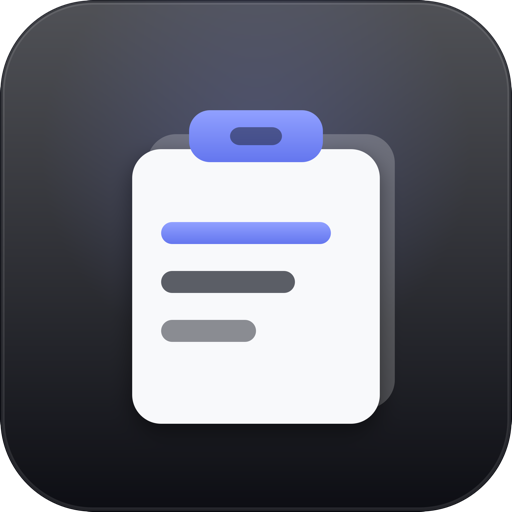

# Clipline

[](https://github.com/joymadhu49/Clipline/actions/workflows/ci.yml)
[](https://github.com/joymadhu49/Clipline/releases/latest)
[](LICENSE)

<p align="center">
  
</p>

A native macOS clipboard manager that lives in the menu bar. Everything you copy is kept, searchable, and one shortcut away.

## Features

- **History** of text, rich text, links, colours, images and files. Duplicates fold into one entry.
- **Pinning** with ⌘P. Pinned entries stay at the top and are never trimmed.
- **Popup panel** on ⌘⇧V, anywhere. It opens where you last left it, at the size you left it.
- **Search and filters** for pinned, text, links, images and files.
- **Paste back** into the app you were in, with or without formatting.
- **Safe on a shared screen.** The panel is hidden from screen recording and sharing, and any entry can be masked with ⌘H.
- **Limits you choose.** Keep up to 2,500 entries, and keep them from 3 hours to forever.
- **Automatic updates**, signed and verified before they install.

## Install

Requires macOS 14 or later, on Apple silicon or Intel.

1. Download the latest `.dmg` from [Releases](https://github.com/joymadhu49/Clipline/releases/latest).
2. Drag **Clipline** into Applications and open it.
3. Allow Accessibility access when macOS asks, so Clipline can paste for you.

The app is signed and notarized by Apple. Updates arrive on their own from then on.

## Keys

| Shortcut | Action |
| --- | --- |
| ⌘⇧V | Open the clipboard panel |
| ⌥⇧⌘P | Open pinned entries |
| return | Paste the selected entry |
| ⌥ return | Paste without formatting |
| ⌘ return | Copy without pasting |
| ⌘1 to ⌘9 | Paste that row |
| ⌘P | Pin or unpin |
| ⌘H | Mask or unmask the entry |
| ⌘⌫ | Delete the entry |
| ⌘F | Show or hide search |
| tab | Next filter |
| esc | Clear the search, then close |

The global shortcuts can be changed in Settings > Shortcuts.

## Privacy

- Your clipboard never leaves your Mac. The only network request is the daily update check.
- Passwords that apps mark as concealed are skipped, as is anything copied from Keychain Access, 1Password or Bitwarden. You can add more apps.
- History can be cleared automatically when Clipline quits.

## Build from source

```sh
brew install xcodegen
git clone https://github.com/joymadhu49/Clipline.git
cd Clipline
bash Scripts/build.sh
cp -R build/Clipline.app /Applications/
```

## License

[MIT](LICENSE). Copyright 2026 Joy Madhu.
